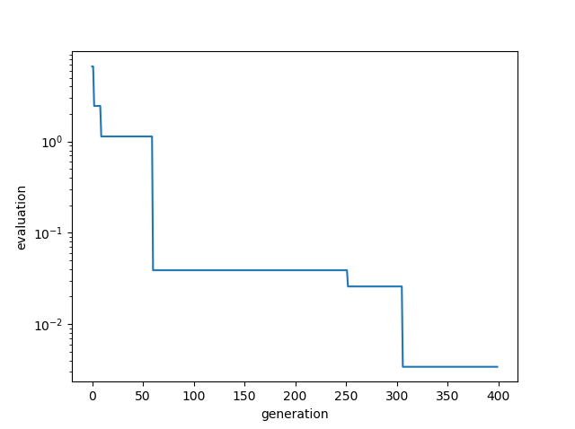
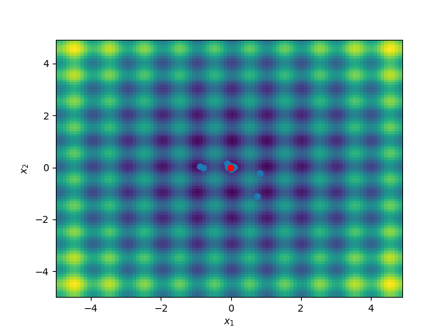

# Real-coded-genetic-algorithm
Real coded genetic algorithm with JGG and AREX 

The details are described in the following blog. 
https://st1990.hatenablog.com/entry/2019/04/21/212326 

Articles of JGG and AREX 
https://www.jstage.jst.go.jp/article/tjsai/24/6/24_6_446/_pdf 

Minimizing quadratic function(n=100). 
.png) 

Calculation Result of multiple regression coefficient(n=100, σ=0.01). 
.png) 

# Minimizing Rastrigin function
In `test_rastrigin.py`, the objective function to be minimized, called Rastrigin function, is defined as follows:

$$
f(x_{1}, x_{2})=20+\sum_{i=1}^{2}(x_{i}^2-10\cos(2\pi x_{i}))
$$

This function takes the minimum value $0$ at $(x_{1}, x_{2})=(0, 0)$. Optimization results are shown in the images below. They indicate that the global optimal solution has been obtained.

